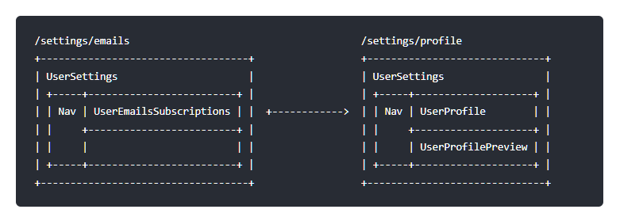

# Vue Router(v3)

## Programmatic Navigation

### router.push(location, onComplete?, onAbort?)

> 注意：在 Vue 实例内部，你可以通过 `$router` 访问路由实例。因此你可以调用 `this.$router.push`。

想要导航到不同的 URL，则使用 router.push 方法。这个方法会向 history 栈添加一个新的记录，所以，当用户点击浏览器后退按钮时，则回到之前的 URL。

当你点击 `<router-link>` 时，这个方法会在内部调用，所以说，点击 `<router-link :to="...">` 等同于调用 `router.push(...)`。

| 申明式                    | 编程式             |
| ------------------------- | ------------------ |
| `<router-link :to="...">` | `router.push(...)` |

该方法的参数可以是一个字符串路径，或者一个描述地址的对象。例如：

```javascript
// 字符串
router.push("home");

// 对象
router.push({ path: "home" });

// 命名的路由
router.push({ name: "user", params: { userId: "123" } });

// 带查询参数，变成 /register?plan=private
router.push({ path: "register", query: { plan: "private" } });
```

> 注意：如果提供了 path，params 会被忽略，上述例子中的 query 并不属于这种情况。取而代之的是下面例子的做法，你需要提供路由的 name 或手写完整的带有参数的 path：

```javascript
const userId = "123";
router.push({ name: "user", params: { userId } }); // -> /user/123
router.push({ path: `/user/${userId}` }); // -> /user/123
// 这里的 params 不生效
router.push({ path: "/user", params: { userId } }); // -> /user
```

同样的规则也适用于 router-link 组件的 to 属性。

在 2.2.0+，可选的在 router.push 或 router.replace 中提供 onComplete 和 onAbort 回调作为第二个和第三个参数。这些回调将会在导航成功完成 (在所有的异步钩子被解析之后) 或终止 (导航到相同的路由、或在当前导航完成之前导航到另一个不同的路由) 的时候进行相应的调用。在 3.1.0+，可以省略第二个和第三个参数，此时如果支持 Promise，router.push 或 router.replace 将返回一个 Promise。

> 注意： 如果目的地和当前路由相同，只有参数发生了改变 (比如从一个用户资料到另一个 /users/1 -> /users/2)，你需要使用 beforeRouteUpdate 来响应这个变化 (比如抓取用户信息)。

### router.replace(location, onComplete?, onAbort?)

跟 router.push 很像，唯一的不同就是，它不会向 history 添加新记录，而是跟它的方法名一样 —— 替换掉当前的 history 记录。
|声明式 |编程式|
|---|---|
|`<router-link :to="..." replace>`|`router.replace(...)`|

### router.go(n)

这个方法的参数是一个整数，意思是在 history 记录中向前或者后退多少步，类似 window.history.go(n)

```js
// 在浏览器记录中前进一步，等同于 history.forward()
router.go(1);

// 后退一步记录，等同于 history.back()
router.go(-1);

// 前进 3 步记录
router.go(3);

// 如果 history 记录不够用，那就默默地失败呗
router.go(-100);
router.go(100);
```

## Named Routes

有时候，通过一个名称来标识一个路由显得更方便一些，特别是在链接一个路由，或者是执行一些跳转的时候。你可以在创建 Router 实例的时候，在 routes 配置中给某个路由设置名称。

```js
const router = new VueRouter({
  routes: [
    {
      path: "/user/:userId",
      name: "user", // named 'user'--'/user/:userId'
      component: User,
    },
  ],
});
```

要链接到一个命名路由，可以给 router-link 的 to 属性传一个对象：

`<router-link :to="{ name: 'user', params: { userId: 123 }}">User</router-link>`

这跟代码调用 router.push() 是一回事：

`router.push({ name: 'user', params: { userId: 123 } })`

这两种方式都会把路由导航到 /user/123 路径。

## Named Views

有时候想同时 (同级) 展示多个视图，而不是嵌套展示，例如创建一个布局，有 sidebar (侧导航) 和 main (主内容) 两个视图，这个时候命名视图就派上用场了。你可以在界面中拥有多个单独命名的视图，而不是只有一个单独的出口。如果 router-view 没有设置名字，那么默认为 default。

```html
<router-view class="view one"></router-view>
<router-view class="view two" name="a"></router-view>
<router-view class="view three" name="b"></router-view>
```

一个视图使用一个组件渲染，因此对于同个路由，多个视图就需要多个组件。确保正确使用 components 配置 (带上 s)：

```js
const router = new VueRouter({
  routes: [
    {
      path: "/",
      components: {
        default: Foo,
        a: Bar,
        b: Baz,
      },
    },
  ],
});
```

### 嵌套命名视图

我们也有可能使用命名视图创建嵌套视图的复杂布局。这时你也需要命名用到的嵌套 router-view 组件。我们以一个设置面板为例：



- Nav 只是一个常规组件。
- UserSettings 是一个视图组件。
- UserEmailsSubscriptions、UserProfile、UserProfilePreview 是嵌套的视图组件。

UserSettings 组件的 `<template>` 部分应该是类似下面的这段代码：

```html
<!-- UserSettings.vue -->
<div>
  <h1>User Settings</h1>
  <NavBar />
  <router-view />
  <router-view name="helper" />
</div>
```

然后你可以用这个路由配置完成该布局：

```js
{
  path: '/settings',
  // 你也可以在顶级路由就配置命名视图
  component: UserSettings,
  children: [{
    path: 'emails',
    component: UserEmailsSubscriptions
  }, {
    path: 'profile',
    components: {
      default: UserProfile,
      helper: UserProfilePreview
    }
  }]
}
```

## Redirect and Alias

### 重定向

重定向也是通过 routes 配置来完成，下面例子是从 /a 重定向到 /b：

```JS
const router = new VueRouter({
  routes: [
    { path: '/a', redirect: '/b' }
  ]
})
```

重定向的目标也可以是一个命名的路由：

```JS
const router = new VueRouter({
  routes: [
    { path: '/a', redirect: { name: 'foo' }}
  ]
})

```

甚至是一个方法，动态返回重定向目标：

```JS
const router = new VueRouter({
  routes: [
    { path: '/a', redirect: to => {
      // 方法接收 目标路由 作为参数
      // return 重定向的 字符串路径/路径对象
    }}
  ]
})
```

> 注意导航守卫并没有应用在跳转路由上，而仅仅应用在其目标上。在下面这个例子中，为 /a 路由添加一个 beforeEnter 守卫并不会有任何效果。

### 别名

“重定向”的意思是，当用户访问 /a 时，URL 将会被替换成 /b，然后匹配路由为 /b，那么“别名”又是什么呢？

**/a 的别名是 /b，意味着，当用户访问 /b 时，URL 会保持为 /b，但是路由匹配则为 /a，就像用户访问 /a 一样。**

```JS
const router = new VueRouter({
  routes: [
    { path: '/a', component: A, alias: '/b' }
  ]
})
```

> “别名”的功能让你可以自由地将 UI 结构映射到任意的 URL，而不是受限于配置的嵌套路由结构。

## Navigation Guards

> “导航”**表示路由正在发生改变**。

正如其名，vue-router 提供的导航守卫主要用来通过跳转或取消的方式守卫导航。有多种机会植入路由导航过程中：全局的, 单个路由独享的, 或者组件级的。

记住参数或查询的改变并不会触发进入/离开的导航守卫。你可以通过观察 $route 对象来应对这些变化，或使用 beforeRouteUpdate 的组件内守卫。

### 全局前置守卫

你可以使用 router.beforeEach 注册一个全局前置守卫：

```js
const router = new VueRouter({ ... })

router.beforeEach((to, from, next) => {
  // ...
})

```

当一个导航触发时，全局前置守卫按照创建顺序调用。守卫是异步解析执行，此时导航在所有守卫 resolve 完之前一直处于 **等待中**。
每个守卫方法接收三个参数：

- to: Route: 即将要进入的目标 路由对象

- from: Route: 当前导航正要离开的路由

- next: Function: 一定要调用该方法来 resolve 这个钩子。执行效果依赖 next 方法的调用参数。

  - next(): 进行管道中的下一个钩子。如果全部钩子执行完了，则导航的状态就是 confirmed (确认的)。

  - next(false): 中断当前的导航。如果浏览器的 URL 改变了 (可能是用户手动或者浏览器后退按钮)，那么 URL 地址会重置到 from 路由对应的地址。

  - next('/') 或者 next({ path: '/' }): 跳转到一个不同的地址。当前的导航被中断，然后进行一个新的导航。你可以向 next 传递任意位置对象，且允许设置诸如 replace: true、name: 'home' 之类的选项以及任何用在 router-link 的 to prop 或 router.push 中的选项。

  - next(error): (2.4.0+) 如果传入 next 的参数是一个 Error 实例，则导航会被终止且该错误会被传递给 router.onError() 注册过的回调。

**确保 next 函数在任何给定的导航守卫中都被严格调用一次。它可以出现多于一次，但是只能在所有的逻辑路径都不重叠的情况下，否则钩子永远都不会被解析或报错。**

这里有一个在用户未能验证身份时重定向到 /login 的示例：

```js
// BAD
router.beforeEach((to, from, next) => {
  if (to.name !== "Login" && !isAuthenticated) next({ name: "Login" });
  // 如果用户未能验证身份，则 `next` 会被调用两次
  next();
});
```

```js
// GOOD
router.beforeEach((to, from, next) => {
  if (to.name !== "Login" && !isAuthenticated) next({ name: "Login" });
  else next();
});
```
